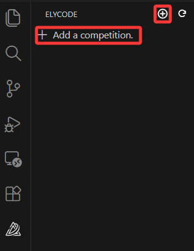
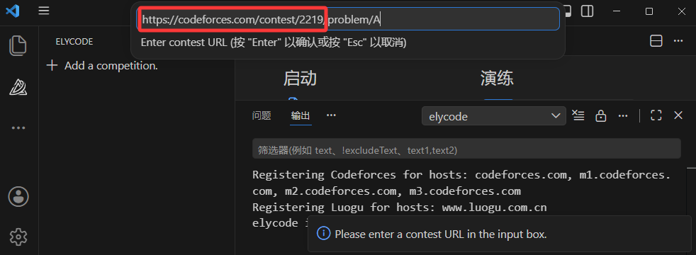
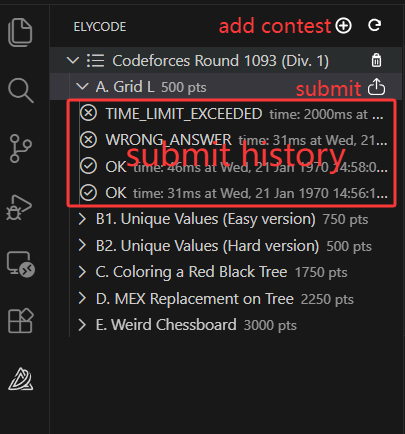
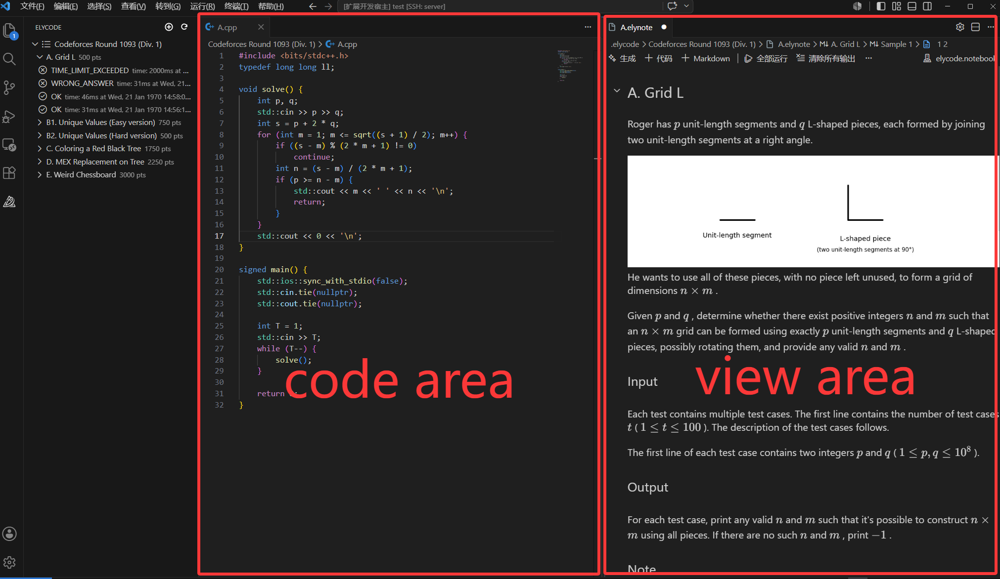
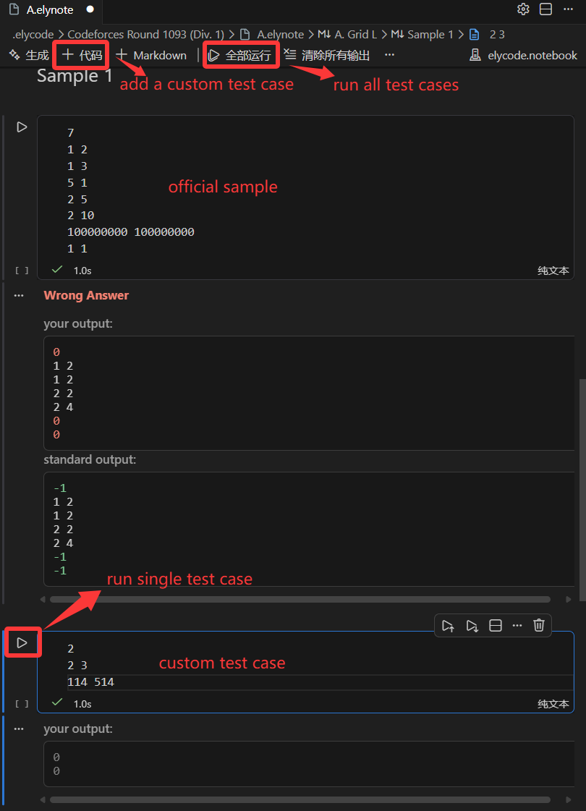
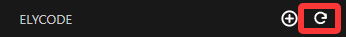

# elycode

<p align="center">
  <a href="./README.md">English</a> | <a href="./README.zh-CN.md">简体中文</a>
</p>

<p align="center">
  
</p>

<p align="center">
  <a href="https://marketplace.visualstudio.com/items?itemName=yuxuaan.elycode">
    
  </a>
  <a href="LICENSE"></a>
</p>

`elycode` is a one-stop VS Code extension for competitive programming practice. It enables code management, testing, and submission in a single workflow.

## Key Features

- **Import**: Import problems from contest URLs **without login** and  **without a browser plugin**
- **Test**: Support **sample testing** and comparison with sample answers, and add custom test cases
- **Submit**: Support jumping to the problem submission website and viewing historical submission records
- **Display**: Present problem information, samples, contests, and submission statistics clearly in the sidebar
- **Code**: Automatically generate corresponding C++ source files (`.cpp`), auto-detect GCC, and support automatic GCC download/configuration on Windows (more programming languages will be supported in future releases)
- **Theme**: Support VS Code light and dark themes

## Quick Start

1. Open VS Code and install the `elycode` extension from the Extensions Marketplace.
2. Open the `elycode` sidebar view and you can click the button to add the contest you need.  

    

3. In the pop-up input box, enter the URL of the contest you want to add. The URL **must contain the ID of the contest**.

    

4. You can use the sidebar view provided by `elycode` to manage and view contest problems, and you can also submit solutions for them.

    

5. By **clicking the problem name**, you can open the coding interface. The left side is the **code area** where you can implement your algorithm, and the right side is the **view area** that displays all problem information.

    

   The **view area** also supports adding test cases and running sample cases and custom cases.

    

6. Optional: If you want to display related data such as submission history, you should configure the usernames for the corresponding platforms. See the [Configuration](#configuration) section for `elycode.platform.codeforces.UserName` and `elycode.platform.luogu.UserName`. `elycode` will also update the data every `elycode.platform.updateContestInfoInterval(seconds)` seconds, and you can manually refresh it by using the button.

    

## Supported System (Test Environment)

- Linux: Ubuntu 22.04 with kernel `5.15.0-181-generic`
- Windows: Windows 11 Pro for Workstations, version `25H2`, OS build `26200.7840`

## Supported Platforms

- [x] Codeforces
- [x] Luogu
- [ ] AtCoder
- [ ] Other common contest platforms

## Supported Code Languages

- [x] C/Cpp
- [ ] Java
- [ ] Rust
- [ ] Python
- [ ] Go
- [ ] JavaScript


## Configuration

The extension provides the following VS Code settings:

- `elycode.compiler.detectMode`: `auto detect(gcc)` or `custom(gcc)`.
- `elycode.compiler.customPath`: Custom GCC path, used only when `custom(gcc)` is selected.
- `elycode.compiler.extraParams`: Additional compiler parameters, default is `-std=c++17`.
- `elycode.running.timeLimit(seconds)`: Execution time limit per submission, default is `2` seconds.
- `elycode.running.memoryLimit(MB)`: Memory limit per submission, default is `256` MB.
- `elycode.code.templateMode`: Code template mode, either `auto` or `custom`.
- `elycode.code.customTemplate`: Custom code template, used only when `custom` mode is selected.
- `elycode.platform.codeforces.UserName`: Codeforces user name for fetching submission statistics.
- `elycode.platform.luogu.UserName`: Luogu user name for fetching submission statistics.
- `elycode.platform.updateContestInfoInterval(seconds)`: Interval in seconds for auto refreshing contest statistics, default is `60`.

## Development and Build

This project is built with TypeScript.

```bash
npm install
npm run compile
npm run watch
```

- `npm run compile`: Compile the TypeScript source.
- `npm run watch`: Start TypeScript watch mode.

Since the VS Code extension development environment is configured, you can also test and develop the extension in the integrated development environment through the VS Code launch configuration.

## Todo List

- Support more platform and code languages
- Fix error when quickly switching problems

## License

MIT License

## Note

This extension was developed by an individual in their spare time. It may still contain various issues or bugs, and feedback as well as pull requests are warmly welcome.

⭐ Wishing everyone great success in their ACM or OI journey. ⭐
